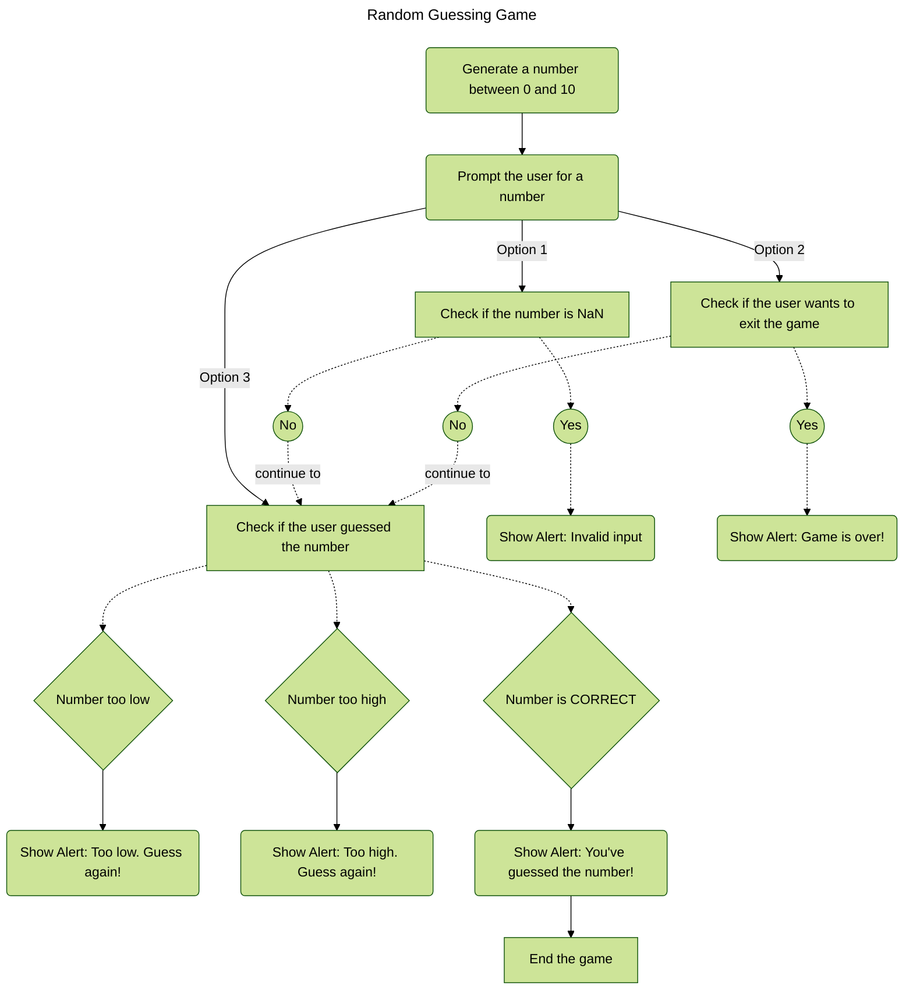

```mermaid

---
title: Random Guessing Game
config:
  layout: dagre
  look: classic
  theme: forest
---
flowchart TD
    A(Generate a number between 0 and 10) --> B(Prompt the user for a number) 
    B --> |Option 1| D[Check if the number is NaN]
    B --> |Option 2| C[Check if the user wants to exit the game ]
    B --> |Option 3| E[Check if the user guessed the number]
    D .-> F((Yes))
    D .-> G((No))
    C .-> H((Yes))
    C .-> I((No))
    E .-> J{Number too low}
    E .-> K{Number too high}
    E .-> L{Number is CORRECT}
    F .-> M(Show Alert: Invalid input)
    G .-> |continue to|E
    H .-> O(Show Alert: Game is over!)
    I .-> |continue to|E
    J --> P(Show Alert: Too low. Guess again!)
    K --> Q(Show Alert: Too high. Guess again!)
    L --> R(Show Alert: You've guessed the number!)
    R --> S[End the game]
```